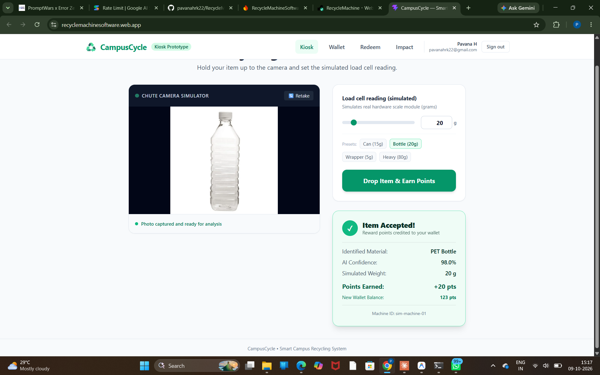
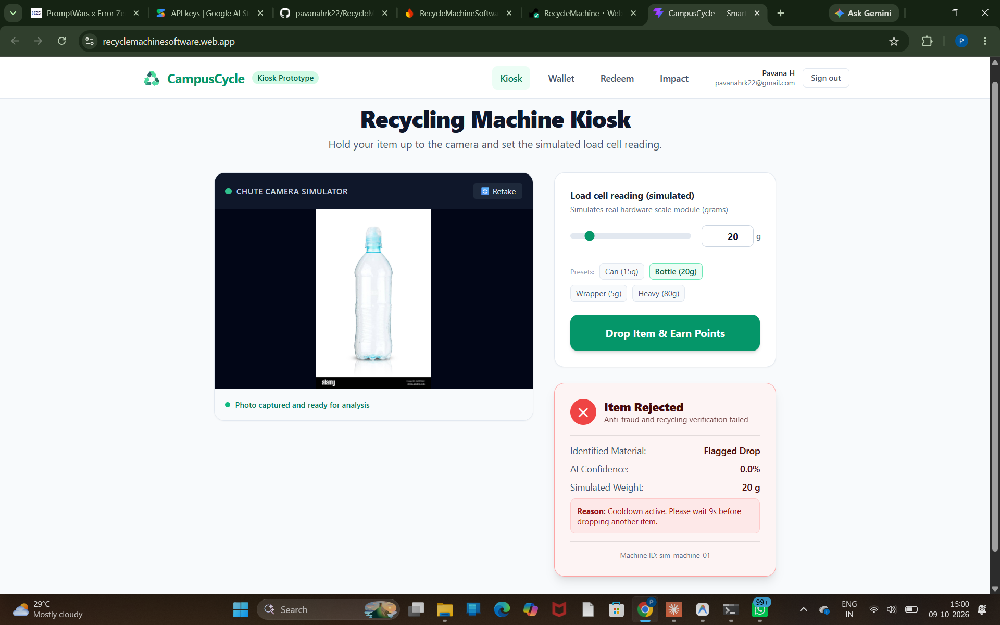
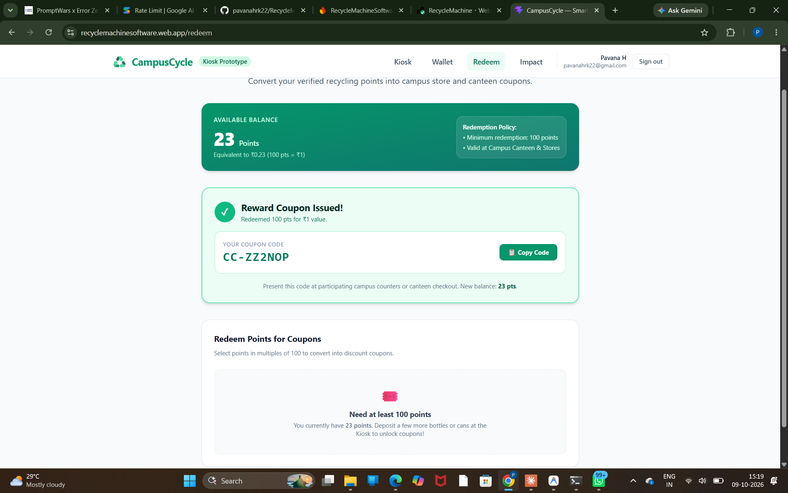
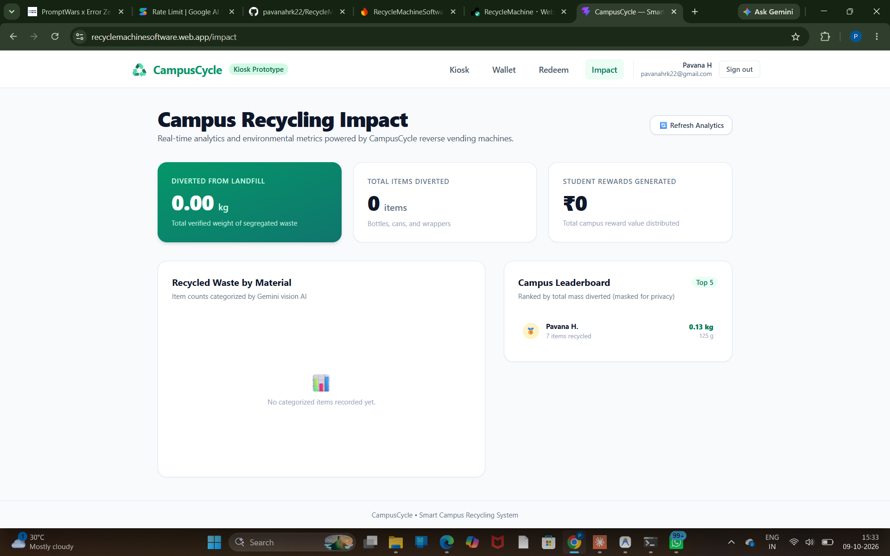

# CampusCycle

**A software-only recycling machine prototype for Smart Campus.**
Drop a bottle or wrapper, get verified rewards, see the campus impact.

PromptWars x Error Zero (Hack2skill, Google for Developers) | Track: Smart Campus

- Live app: https://recyclemachinesoftware.web.app
- API: https://recyclemachine.onrender.com (free tier, first request can take 30-60 s: open `/health` first)

## Problem

Campus bins mix recyclables with trash, and nothing rewards students for sorting waste correctly. Existing reverse-vending machines are expensive hardware that most campuses will never buy.

## Solution

CampusCycle is the software layer of a recycling machine, built so a cheap physical unit can plug in later.

1. A student signs in with Google and drops an item at the web kiosk (webcam or upload, plus a simulated load-cell weight).
2. `POST /api/drop` sends the image to Gemini vision, which classifies the item and rejects contaminated or multi-item drops.
3. The backend checks weight bounds, confidence, cooldown, daily caps and duplicates, then converts weight to points.
4. Points go into a wallet and can be redeemed for a mock canteen/store coupon.
5. A dashboard shows campus-wide impact (items, kg diverted, rewards, material breakdown, leaderboard).

**Hardware story:** a real machine only needs a Raspberry Pi, a camera and a load cell calling the same `POST /api/drop` endpoint. Nothing else changes.

## Screenshots

| Kiosk: item accepted | Duplicate rejected |
|---|---|
|  |  |

| Redeem: coupon issued | Impact dashboard |
|---|---|
|  |  |

## Points and rules

Rates live in `backend/config/rates.json` (configurable).

| Material | Rate | Valid weight |
|---|---|---|
| PET bottle | 100 pts / 100 g | 8-60 g |
| Aluminium can | 150 pts / 100 g | 8-25 g |
| Rigid plastic | 80 pts / 100 g | 5-150 g |
| Snack wrapper | 50 pts / 100 g | 1-12 g |
| Non-recyclable / no item | 0 | n/a |

100 points = Rs 1. Points round up. Minimum AI confidence 0.70.

## Anti-fraud and privacy

- Points are computed on the backend only; the client never sends points.
- Weight must fall inside the plausible range for the detected material.
- Gemini rejects contaminated items and multiple items in one drop.
- SHA-256 image hash blocks the same image from the same user within 24 h.
- 12 s cooldown per user; daily cap of 30 drops or 1000 g per user.
- Images are never stored; only the hash is kept.
- Redeem is server-validated and runs inside a Firestore transaction; coupon codes are generated server-side.

## Architecture

```
React kiosk (Firebase Hosting)  --Firebase ID token-->  FastAPI (Render)
                                                          |-- Gemini vision (classifier)
                                                          |-- rules engine (bounds, caps, hash)
                                                          '-- Firestore (users, drops, redemptions, stats/campus)
```

- Frontend: Vite, React, Tailwind, Firebase Auth, Recharts, React Router
- Backend: FastAPI, Firebase Admin, Google Gemini (`gemini-3.8-flash`)
- Data: Firestore with atomic transactions for drops and redemptions

API: `POST /api/drop`, `GET /api/me`, `GET /api/drops`, `POST /api/redeem`, `GET /api/stats`, `GET /health`.

## Run locally

Backend (from `backend`):

```
python -m venv venv
.\venv\Scripts\pip install -r requirements.txt
copy .env.example .env      # then fill in your own values
.\venv\Scripts\uvicorn app.main:app --reload --port 8000
```

Frontend (from `frontend`):

```
npm install
copy .env.example .env      # then fill in your own Firebase values
npm run dev
```

Tests: `.\venv\Scripts\python.exe -m pytest -q` (Gemini is mocked).

## Limitations (honest)

- Weight is simulated by a slider; no real load cell is connected.
- Classification was checked only on a small, controlled demo set (clean bottle, can, wrapper, dirty item, multi-item). Real accuracy needs a larger labelled dataset.
- Coupons are mock. Funding rewards (scrap buyers or campus budget) and the point rates need real-world validation.
- Gemini free tier is limited to a few requests per minute and per day, and can return temporary 503s under load.
- The Render free instance sleeps when idle, so the first request is slow.
- Rejected duplicate drops show a generic "Flagged Drop" card with 0% confidence (cosmetic).

## Roadmap

Raspberry Pi + camera + load-cell client, admin review of flagged drops, daily bonuses, Hindi/Kannada UI, a labelled dataset for accuracy measurement.
